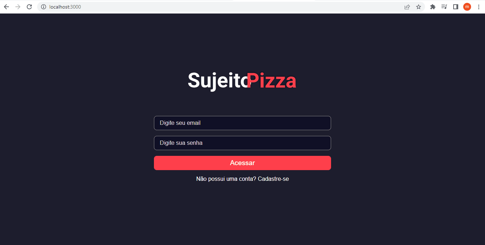

# # Projeto Pizzaria Automatizada
projeto que automatiza os pedidos de uma pizarria

<br>



<br>

<br>

# Tecnologias Utilizadas &#128218;&#128218;

- CSS
- React.JS
- Api
- Axios
- node.js
- PostBird
- Insominia

<br>

# Como Utilizar

Clone o projeto

```
git clone <url>

```
Acesse a pasta do projeto no terminal/cmd

Instale as dependências

```
$ npm install

```
Inicie o projeto

```

npm start

